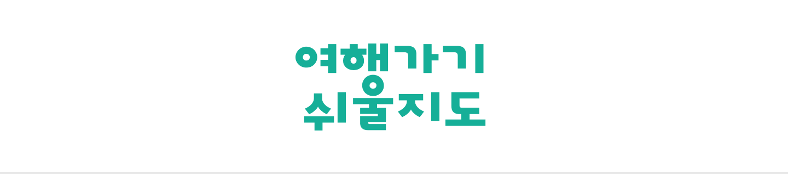
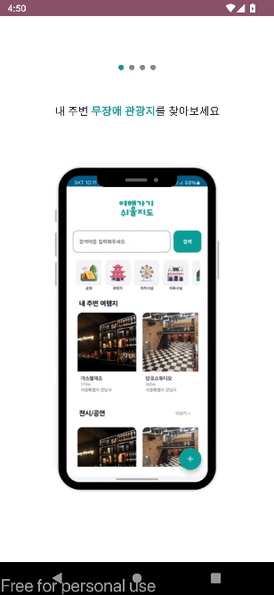
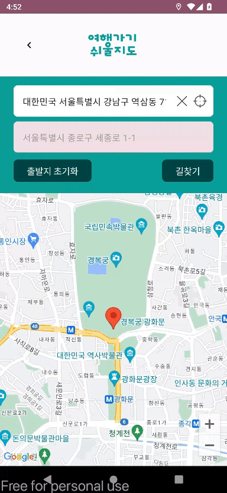
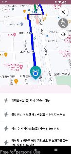
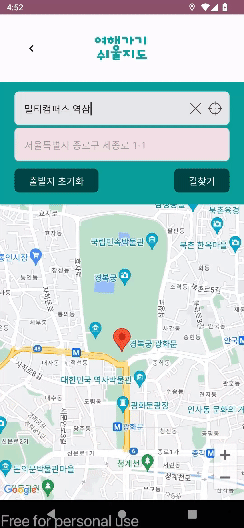
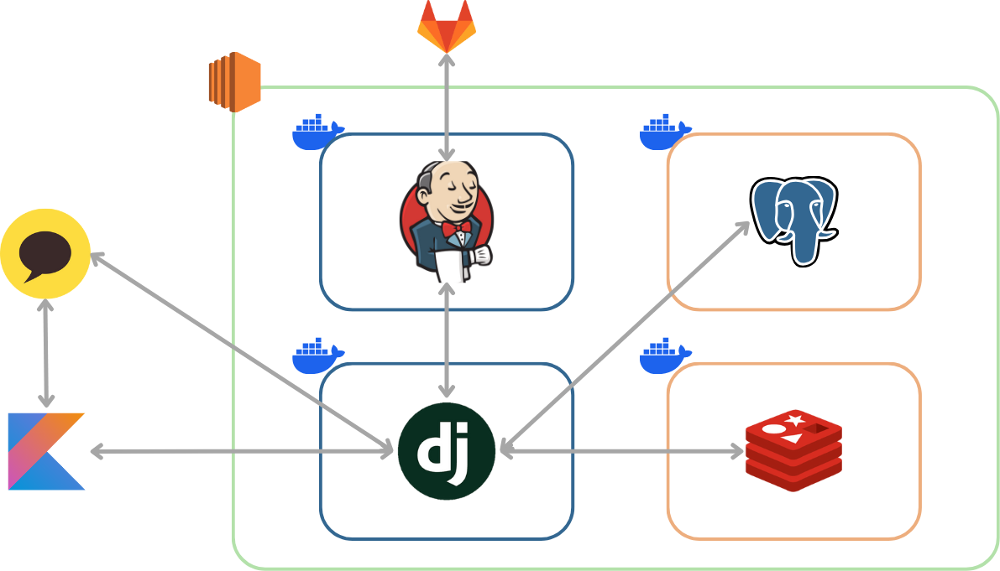
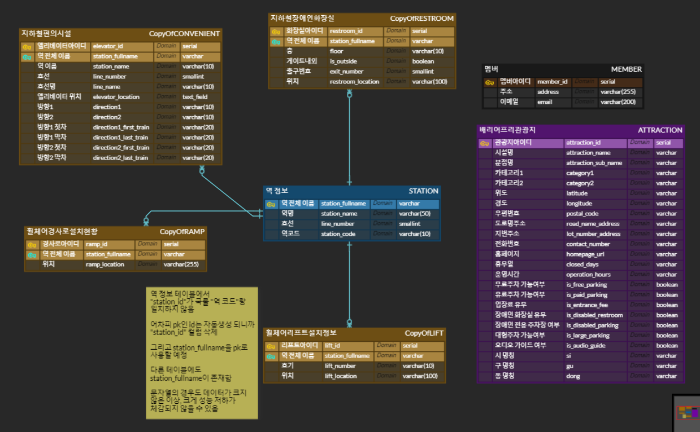
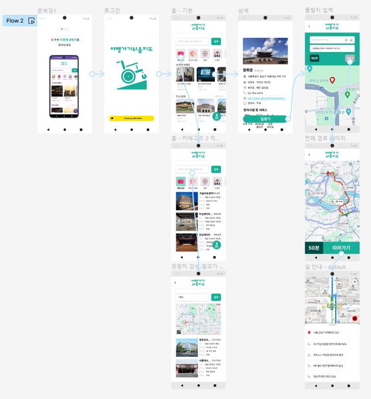

<div align="center" >
    
</div>
<div align="center">

### 휠체어 이용자도 혼자 여행하는 길안내 앱 “여행가기쉬울지도”

</div>

## 프로젝트 소개

- 여행가기쉬울지도는 휠체어 이용자가 혼자서 여행할 수 있는 무장애 관광지를 소개하고 해당 관광지까지 길을 안내하는 앱입니다.
- 휠체어 이용자의 상황과 조건에 따른 최적의 경로를 안내합니다.
- 사용자는 엘리베이터가 있는 지하철 출입구를 이용하는 경로를 안내 받으며, 경로 내 지하철 화장실 정보도 알 수 있습니다.

## 개발 기간

2024.04.08 ~ 2024.05.20 (6주)

## 팀원

<table>
  <tr>
        <td align="center" width="16%">
            <a href="https://github.com/ooonjae"></a>
            <br />
            <a href="https://github.com/ooonjae">이운재</a>
        </td>
        <td align="center" width="16%">
            <a href="https://github.com/dforce103"></a>
            <br />
            <a href="https://github.com/dforce103">송찬의</a>
        </td>
        <td align="center" width="16%">
            <a href="https://github.com/hello1334"></a>
            <br />
            <a href="https://github.com/hello1334">전건휘</a>
        </td>
        <td align="center" width="16%">
            <a href="https://github.com/sgryu23"></a>
            <br />
            <a href="https://github.com/sgryu23">류승광</a>
        </td>
        <td align="center" width="16%">
            <a href="https://github.com/jinddobaegi"></a>
            <br />
            <a href="https://github.com/jinddobaegi">정진영</a>
        </td>
        <td align="center" width="16%">
            <a href="https://github.com/suminjeff"></a>
            <br />
            <a href="https://github.com/suminjeff">이수민</a>
        </td>
      <tr>
        <td align="center">    
          <div><b>BE/Infra/팀장</b></div>
        </td>
        </td>
        <td align="center">
            <div><b>App</b></div>
        </td>
        <td align="center">
            <div><b>App/앱배포</b></div>
        </td>
        <td align="center">
            <div><b>App/Design</b></div>
        </td>
        <td align="center">
            <div><b>BE/AI</b></div>
        </td>
        <td align="center">
          <div><b>BE/App/PM</b></div>
        </td>
      </tr>
  </tr>
</table>

## 개발 환경

- **IDE** : `Visual Studio Code` `Android Studio Jellyfish`
- **FE** : `Kotlin 1.9.0` `Ktor 2.3.10` `lifecycle 2.7.0`
- **BE** : `Python 3.12` `Django 5.0.4`
- **AI** : `Python 3.12` `xgboost 2.0.3` `Pandas 2.2.2`
- **INFRA** : `Ubuntu 22.04.4 LTS` `Docker 26.1.0` `jenkins 2.440.3` `Redis 5.0.4` `PostgreSQL 16.2`

## 기술 스택

### Front-end

<div>


</div>

### Back-end

<div>


</div>

### AI

<div>


</div>

### Infra

<div>


</div>

### 협업Tools

<div>


</div>

<br />

## 주요 기능

### 어플리케이션 접속 화면

- 첫 접속 화면
- 여행가기쉬울지도를 전체적으로 소개
- 시작하기 버튼을 통해 서비스를 시작



---

### 로그인

- 소셜 로그인을 통해 간단하게 가입, 로그인
- 소셜 로그인은 카카오을 지원


---

### 메인페이지

- 위치권한요청을 통해 수락하면 GPS위치 기반 가장 가까운 순서로 무장애 관광지를 리스트 업
- 더보기를 누르면 해당 카테고리별 관광지 안내
- 카테고리에 해당하는 아이콘을 누르면 해당 관광지 안내


---

### 검색페이지

- 관광지명, 지역을 검색하면 해당하는 관광지를 리스트 업
- 상단의 구글 지도에서 관광지들의 위치를 확인할 수 있음


---

### 상세페이지

- 상세페이지에서 사진과 개관 시간, 휴무일, 홈페이지 등을 확인할 수 있음
- 무료주차장 여부, 장애인 화장실 여부 등 장애인 편의시설을 확인할 수 있음


---

### 출발페이지

- GPS를 기반으로 현재 위치가 출발 input박스에 기본으로 입력됨
- 사용자가 출발 input박스를 수정할 수 있음



---

### 전체경로페이지

- 머신러닝을 통해 계산된 ETA(예상도착시간)을 안내
- 전체적인 경로를 미리 확인할 수 있음


---

### 가이드페이지

- gps를 실시간 추척하여 길안내를 함
- 우상단 3번째 gps버튼을 클릭시 gps위치로 카메라를 다시 이동시킴
- 우상단 2번째 화장실 버튼을 클릭시 역내 지하철 장애인 화장실의 위치를 구글맵에 표시함
- 우상단 1번째 버튼을 클릭시 길안내를 종료함



---

### 집으로가기

- 관광을 종료하고 집으로 갈 때 홈으로 버튼을 눌러 쉽게 길안내를 받을 수 있음



---

## 아키텍쳐 다이어그램



## ERD



## 와이어프레임



## 디렉토리 구조

<h3> 
<details>
<summary>frontend</summary>
<div markdown="1">

```shell
📦app
├─📂manifests
├─📂kotlin+java
│  ├─📂data.preferences
│  ├─📂ui
│  │  └─📂components
│  │  └─📂datatype
│  │  └─📂network
│  │  └─📂screen
│  │  └─📂theme
│  │  └─📂viewmodel
│  └─📂styles
│     └─📂font
├─📂res
│  ├─📂drawable
│  ├─📂mipmap
│  ├─📂values
│  ├─📂xml
```

</div>
</details>

<h3> 
<details>
<summary>backend</summary>
<div markdown="1">

```shell
📦backend
 ┣ 📂abletotrip
 ┃ ┗ 📂settings
 ┣ 📂attraction
 ┣ 📂member
 ┗ 📂navigation
   ┗ 📂trained_models
```

</div>
</details>
